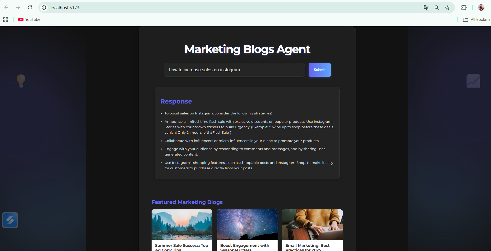
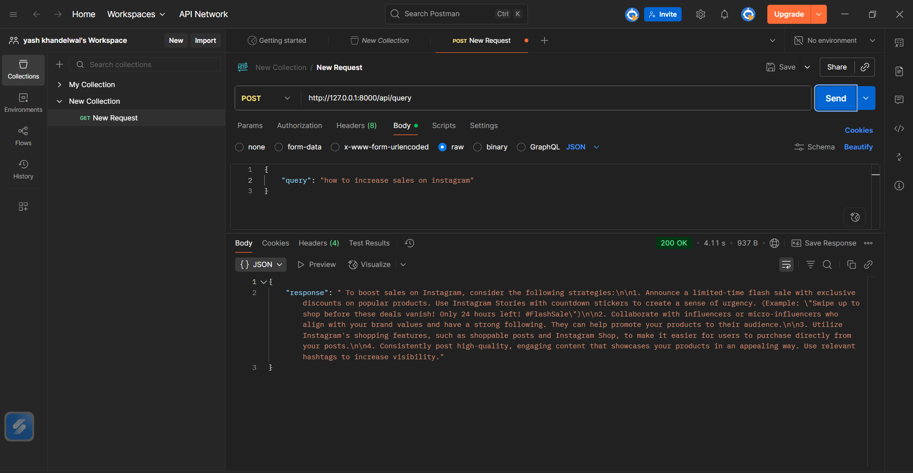

# Agent-for-Marketing-Blogs
An agent that uses a vector database (like Chroma or Pinecone) to search a set of marketing blogs and answer a user's query (e.g. "Best ad copy for summer sale campaigns")

This project has two parts:

Backend (Python + FastAPI) → Handles embeddings, Pinecone, and query logic.

Frontend (React + Vite) → Simple web interface to interact with the agent.

# how to run ?
### STEPS:

clone the repository

```bash
git clone https://github.com/Yash55555555555/Agent-for-Marketing-Blogs.git
```

### STEP 01 --> Create the virtual environment after opening the repository

```bash
conda create -n venv python=3.10 -y
```

```bash
conda activate venv
```

### STEP 02 --> install the requiremnts
```bash
pip install -r requirements.txt
```

### STEP 03 --> Setup Environment Variables
create a .env file in the root directory and add your pinecone and openrouter api key as follows , for the performance testing purpose you can add langchain api key for testing future tasks 

```
PINECONE_API_KEY="XXXXXXXXXXXXXXXXXXXXXXXXXXXXXXXXXXXXXXXXXXXXX"
LANGCHAIN_API_KEY=XXXXXXXXXXXXXXXXXXXXXXXXXXXXXXXXXXXXXXXXXXXXX
LANGCHAIN_PROJECT="Agent for marketing blog"
OPENROUTER_API_KEY="XXXXXXXXXXXXXXXXXXXXXXXXXXXXXXXXXXXXXXXXXXX"
```

### Step 4 → Store Embeddings in Pinecone
```
# run the following command to store embeddings to pinecone
python store_index.py
```

### Step 5 --> Run the Backend
```
python app.py
```
by default the backend will start at
http://127.0.0.1:8000


# Frontend Setup
The frontend is built with React + Vite and is located inside the frontend folder.

### Step 1 → Move into the frontend folder
```
cd frontend
```

### Step 2 → Install Node dependencies
```
npm install
```

### Step 3 → Start the Frontend
```
npm run dev
```
This will start the frontend at:
http://localhost:5173


### ✅ Usage

```
Run the backend (Python FastAPI).

Run the frontend (React + Vite).

Open your browser at http://localhost:5173 to interact with the agent.
```

# Notes--> 
```
Make sure your Pinecone and API keys are valid.

Backend should be running before starting the frontend.

You can modify blog sources or add more data in the backend to improve results.
```

# for the  demo video and images see the assets folder 





